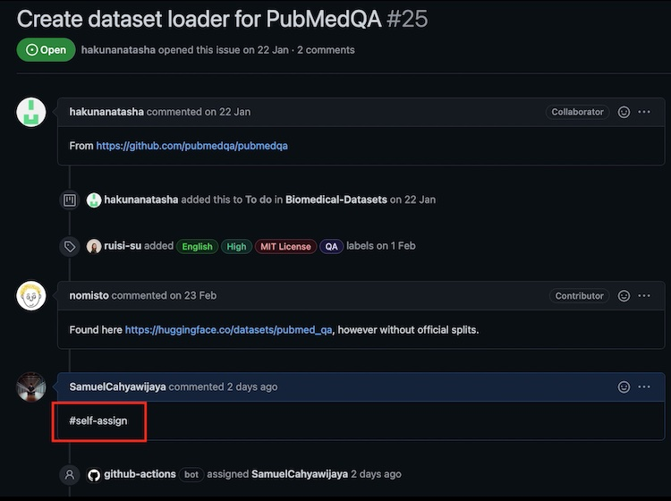

### Stay tuned - we'll have a "Meet the Team" call on Wednesday April 6, (8 AM PST/ 11 AM EST/ 5 PM CET). Access the [zoom registration here](https://virginia.zoom.us/meeting/register/tJwsf-qqpzsvHdbe6tWsAmRjEvf1yIvZ8ODL)

# Welcome to the BigScience🌸 Biomedical NLP Hackathon!

Huggingface's BigScience🌸 initative is an open scientific collaboration of nearly 600 researchers from 50 countries and 250 institutions who collaborate on various projects within the natural language processing (NLP) space to broaden accessibility of language datasets while working on challenging scientific questions around language modeling.  
<!--- @Natasha From the Data_sourcing wiki  --->

We are running a **Biomedical Datasets hackathon** to centralize many NLP datasets in the biological and medical space. Biological data is diverse, so a unified location that joins multiple sources while preserving the data closest to the original form can greatly help accessbility.

## Goals of this hackathon

Our goal is to **enable easy programatic access to these datasets** using Huggingface's (🤗) [`datasets` library](https://huggingface.co/docs/datasets/). To do this, we propose a unified schema for dataset extraction, with the intention of implementing as many biomedical datasets as possible to enable **reproducibility in data processing**. 

There are two broad licensing categories for biomedical datasets:

##### 1. Public Data (Public Domain, Creative Commons, Apache 2.0, etc.)
##### 2. External Data Use Agreements (PhysioNet, i2b2/n2c2, etc.)

We will accept data-loading scripts for either type; please see the [FAQs](#FAQs) for more explicit details on what we propose.

### Why is this important?

Biomedical language data is highly specialized, requiring expert curation and annotation. Many great initiatives have created different language data sets across a variety of biological domains. A **centralized source that allows users to access relevant information reproducibly** greatly increases accessibility of these datasets, and promotes research.

Our unified schema allows researchers and practioners to **access the same type of information across a variety of datasets with fixed keys**. This can enable researchers to quickly iterate, and write scripts without worrying about pre-processing nuances specific to a dataset.

## Contribution Guidelines

To be considered a contributor, participants must implement an *accepted data-loading script* to the bigscience-biomedical collection for **at least 3 datasets**. 

Explicit instructions are found in the next section, but the steps for getting a data-loading script accepted are as follows:  

- Fork this repo and write a data-loading script in a new branch
- PR your branch back to this repo and ping the admins
- An admin will review and approve your PR or ping you for changes

Details for contributor acknowledgements and rewards can be found [here](#Thank-you)

## Get started!

### 1. Choose a dataset to implement

There are two options to choose a dataset to implement; you can choose either option, but **we recommend option A**. 

**Option A: Assign yourself a dataset from our curated list**
- Choose a dataset from the [list of Biomedical datasets](https://github.com/orgs/bigscience-workshop/projects/6/). 

    

- Assign yourself an issue by clicking the dataset in the project list, and comment `#self-assign` under the issue. **Please assign yourself to issues with no other collaborators assigned**. You should see your GitHub username associated to the issue within 1-2 minutes of making a comment.

    

- Search to see if the dataset exists in the 🤗 [Hub](https://huggingface.co/datasets). If it exists, please use the current implementation as the `source` and focus on implementing the [task-specific `bigbio` schema](https://github.com/bigscience-workshop/biomedical/blob/master/task_schemas.md). 

**Option B: Implement a new dataset not on the list**

If you have a biomedical or clinical dataset you would like to propose in this collection, you are welcome to [make a new issue](https://github.com/bigscience-workshop/biomedical/issues/new/choose). Choose `Add Dataset` and fill out relevant information. **Make sure that your dataset does not exist in the 🤗 [Hub](https://huggingface.co/datasets).**

If an admin approves it, then you are welcome to implement this dataset and it will count toward contribution credit.

### 2. Implement the data-loading script for your dataset and create a PR

[Check out our step-by-step guide to implementing a dataloader with the bigbio schema](CONTRIBUTING.md).

**Please do not upload the data directly; if you have a specific question or request, [reach out to an admin](#Community-channels)**

As soon as you have opened a PR, the dataset will be marked as `In Progress` in the
[list of Biomedical datasets](https://github.com/orgs/bigscience-workshop/projects/6/).
When an admin accepts the PR and closes the corresponding issue, the dataset will be
marked as `Done`.

## Community channels

We welcome contributions from a wide variety of backgrounds; we are more than happy to guide you through the process. For instructions on how to get involved or ask for help, check out the following options:

#### Join BigScience
Please join the BigScience initiative [here](https://bigscience.huggingface.co/); there is a [google form](https://docs.google.com/forms/d/e/1FAIpQLSdF68oPkylNhwrnyrdctdcs0831OULetgfYtr-aVxBg053zqA/viewform) to fill out to have access to the biomedical working group slack. Once you have filled out this form, you'll get access to BigScience's google drive. There is a document where you can fill your name next to a working group; be sure to fill your name on the "Biomedical" group. 

#### Join our Discord Server
Alternatively, you can ping us on the [Biomedical Discord Server](https://discord.gg/Cwf3nT3ajP). The Discord server can be used to share information quickly or ask code-related questions.

#### Make a Github Issue
For quick questions and clarifications, you can [make an issue via Github](https://github.com/bigscience-workshop/biomedical/issues/new/choose).

You are welcome to use any of the above resources as necessary. 

## FAQs

#### How can I find the appropriate license for my dataset?

The license for a dataset is not always obvious. Here are some strategies to try in your search,

* check the `Experiment A: Annotated Datasets` tab of the [google sheet](https://docs.google.com/spreadsheets/d/1eOa9NhNmgGLByWKZ9ioKmNErq824dGA-nV5WpRWZ4a8/edit?usp=sharing) we used while planning the hackathon 
* check for files such as README or LICENSE that may be distributed with the dataset itself
* check the dataset webpage
* check publications that announce the release of the dataset
* check the website of the organization providing the dataset

If no official license is listed anywhere, but you find a webpage that describes general data usage policies for the dataset, you can fall back to providing that URL in the `_LICENSE` variable. If you can't find any license information, please make a note in your PR and put `_LICENSE="Unknown"` in your dataset script.   

#### What if my dataset is not publicly available?

We understand that some biomedical datasets are not publicly available due to data usage agreements or licensing. For these datasets, we recommend implementing a dataloader script that references a local directory containing the dataset. You can find examples in the [n2c2_2011](examples/n2c2_2011.py) and [bioasq](examples/bioasq.py) implementations. There are also local dataset specific instructions in  [template](templates/template.py).

#### My dataset is in a standard format (e.g. BRAT, BioC). Do I have to write my own parser?

If your dataset is in a standard format, please use a recommended parser if available:
- BioC: Use the excellent [bioc](https://github.com/bionlplab/bioc) package for parsing. Example usage can be found in [examples/bc5cdr.py](examples/bc5cdr.py)
- BRAT: Use [our custom brat parser](utils/parsing.py). Example usage can be found in [examples/mlee.py](examples/mlee.py).

If the recommended parser does not work for you dataset, please alert us in Discord, Slack or the github issue.

#### What types of libraries can we import?

Eventually, your dataloader script will need to run using only the packages supplied by the [datasets](https://github.com/huggingface/datasets) package. If you find a well supported package that makes your implementation easier (e.g. [bioc](https://github.com/bionlplab/bioc)), then feel free to use it. 

We will address the specifics during review of your PR to the [BigScience biomedical repo](https://github.com/bigscience-workshop/biomedical) and find a way to make it usable in the final submission to [huggingface bigscience-biomedical](https://huggingface.co/bigscience-biomedical)

#### Can I upload my dataset anywhere?

No. Please don't upload the dataset you're working on to the huggingface hub or anywhere else.  This is not the goal of the hackathon and some datasets have licensing agreements that prevent redistribution. If the dataset is public, include a downloading component in your dataset loader script. Otherwise, include only an "extraction from local files" component in your dataset loader script. If you have a custom dataset you would like to submit, please [make an issue](https://github.com/bigscience-workshop/biomedical/issues/new) and an admin will get back to you.  

#### My dataset supports multiple tasks with different bigbio schemas. What should I do? 

In some cases, a single dataset will support multiple tasks with different bigbio schemas. For example, the `muchmore` dataset can be used for a translation task (supported by the `Text to Text (T2T)` schema) and a named entity recognition task (supported by the `Knowledge Base (KB)` schema). In this case, please implement one config for each supported schema and name the config `<datasetname>_bigbio_<schema>`. In the `muchmore` example, this would mean one config called `muchmore_bigbio_t2t` and one config called `muchmore_bigbio_kb`.  

#### My dataset comes with multiple annotations per text and no/multiple harmonizations. How should I proceed?

Please implement all different annotations and harmonizations as `source` versions (see [examples/bioasq.py](examples/bioasq.py) for an example).
If the authors suggest a preferred harmonization, use that for the `bigbio` version.
Otherwise use the harmonization that you think is best.

#### How should I handle offsets and text in the bigbio schema?

Full details on how to handle offsets and text in the bigbio kb schema can be found in the [schema documentation](https://github.com/bigscience-workshop/biomedical/blob/master/task_schemas.md).

#### My dataset is complicated, can you help me?

Yes! Please join the hack-a-thon [Biomedical Discord Server](https://discord.gg/Cwf3nT3ajP) and ask for help. 

#### My dataset is too complicated, can I switch?

Yes! Some datasets are easier to write dataloader scripts for than others. If you find yourself working on a dataset that you can not make progress on, please make a comment in the associated issue, asked to be un-assigned from the issue, and start the search for a new unclaimed dataset. 

#### Can I change the Big-Bio schema?

**No, please do not modify the Big-Bio Schema.** The goal of this hackathon is to enable simple, programmatic access to a large variety of biomedical datasets. Part of this requires having a dependable interface. We developed our schema to address the most salient types of questions to ask of the datasets. We would be more than happy to discuss your suggestions, and you are welcome to implement it as a new config.

#### My dataset has multiple labels for a span of text - what do I do?

In many of our schemas, we have a 1:1 mapping between a key and its label (i.e. in KB, entity and label). In some datasets, we've noticed that there are multiple labels assigned to a text entity. Generally speaking, if a big-bio key has multiple labels associated with it, please populate the list with multiple instances of (key, label) according to each label that correspond to it. 

So for instance if the dataset has an entity "copper" with the  types "Pharmacologic Substance" and "Biologically Active", please create one entity with type "Pharmacologic Substance" and an associated unique id *and* another entity with type "Biologically Active" with a different unique id. The rest of the inputs (text, offsets, and normalization) of both entities will be identical.

## Thank you!

We greatly appreciate your help! 

The artifacts of this hackathon will be described in a forthcoming academic paper targeting a machine learning or NLP audience. Implementing 3 or more dataset loaders will guarantee authorship. We recognize that some datasets require more effort than others, so please reach out if you have questions. Our goal is to be inclusive with credit!

## Acknowledgements

This hackathon guide was heavily inspired by [the BigScience Datasets Hackathon](https://github.com/bigscience-workshop/data_tooling/wiki/datasets-hackathon).
