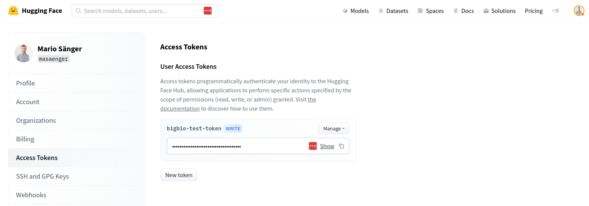

# Review Guide

This guide explains what steps a project administrator needs to perform when updating a dataset 
implementation.

## Checkout PR
First, checkout the pull-request to obtain a local copy using the [GitHub CLI](https://cli.github.com/):
```
gh pr checkout PULL-REQUEST
```

## Basic checks

To ensure the highest possible standard and uniformity of the data set implementations, please check the following dataset requirements.

- The dataset should be implemented in `bigbio/hub/hub_repos/<dataset>` and contain (at least) the three default 
files `<dataset>.py`, `bigbiohub.py` and `README.md`.
- Check whether all data set meta-data are given in `<dataset>.py` and `README.md`. Refer to 
[BC5CDR](bigbio/hub/hub_repos/bc5cdr/) for an example of a complete set of information.


## Run unit tests

Run the following command from the top level of the `biomedical` repo (i.e. the same directory that contains the `requirements.txt` file). 
Check if the new or updated dataloader satisfies our unit tests as follows by using this command in the terminal:

```bash
python -m tests.test_bigbio_hub <dataset_name> [--data_dir /path/to/local/data] --test_local
```

Note, you **MUST** include the `--test_local` flag to specifically test the script for your PR, otherwise 
the script will default to downloading a dataloader script from the Hub. Your particular dataset may 
require use of some of the other command line args in the test script (ex: `--data_dir` for dataloaders 
that read local files).
<br>
To view full usage instructions you can use the `--help` command:

```bash
python -m tests.test_bigbio --help
```
This will explain the types of arguments you may need to test for. A brief annotation is as such:

- `dataset_name`: Name of the dataset you want to test
- `data_dir`: The location of the data for datasets where `LOCAL_ = True`
- `config_name`: Name of the configuration you want to test. By default, the script will test all configs, but if you can use this to debug a specific split, or if your data is prohibitively large.
- `ishub`: Use this when unit testing scripts that are not yet uploaded to the hub (this is True for most cases)

If any (severe) errors occur, report these to the PR author.

## Merge the PR
If all previous checks could be performed successfully merge the PR into main branch:
```
gh pr merge PULL-REQUEST
```

## Update hub dataset
After updating the GitHub repository, the data set needs to be updated in the [BigBio Huggingface 
datasets hub](https://huggingface.co/bigbio). For this, first create or retrieve an API access token
of your huggingface account:

[https://huggingface.co/settings/tokens](https://huggingface.co/settings/tokens)

Note to create a token with write access:




Run the following command from the top-level of the repository to update the data set in the hub:
```
HUGGING_FACE_HUB_TOKEN=<ACCESS-TOKEN>  python bigbio/hub/upload.py <dataset>
```

If the PR is concerned with a completely new data set add the option `-c` for creating a new data
set repo in the hub first:
```
HUGGING_FACE_HUB_TOKEN=<ACCESS-TOKEN>  python bigbio/hub/upload.py <dataset> -c
```

Moreover, you can test your upload command by first running a dry-run using option `-d`:
```
HUGGING_FACE_HUB_TOKEN=<ACCESS-TOKEN>  python bigbio/hub/upload.py <dataset> -d
```

After running the command, visit hub webpage of the data set and check if the model card and the data 
viewer are displayed and the files are updated correctly, e.g. 
[https://huggingface.co/datasets/bigbio/bc5cdr](https://huggingface.co/datasets/bigbio/bc5cdr)
