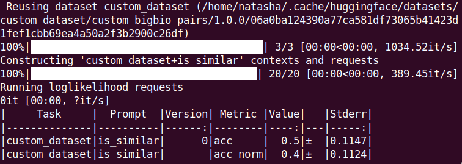

# Prompt engineering with BigBio
#### Last Updated: 2022.07.05

The following tutorial will show you how to:

(1) Generate prompts using the specific `BigBio` fork of *PromptSource*. <br>
(2) Generate a new prompt task in `LmEval` <br>
(3) Evaluate a model of choice for your dataset!

We will be using the dataset `Biosses` within BigBio and treating this as a "custom" dataset to illustrate how to use PromptSource and Lm-Eval-Harness.

**NOTE** This tutorial uses 3 packages: `promptsource`, `lm-eval-harness` and `bigbio`. All of these need to be installed (instructions will be provided) but will require some work outside of the notebook in order to run. Also note, while the prompting templates + bigbio may work as intended, `lm-eval-harness` may not have all the metrics or specifications required for your custom implementation. You may need to add these manually. Feel free to contact us if you need specific help, as these packages are independently maintained, but we are happy to help. 

### Step 0: Preliminaries

In order to work with these packages, you will need to have

- A GitHub account and familiarity with CLI access
- Environment management
- Python 3.3+

We highly recommend you create an environment in order to not create any dependency issues. You can do this as follows:

#### Create a conda environment
The following instructions will create an Anaconda bigscience-biomedical environment.

Install anaconda for your appropriate operating system.
Run the following command while in the biomedical folder (you can pick your python version):

```
conda create -n bigbioprompting python=3.9 # Creates a conda env
conda activate bigbioprompting  # Activate your conda environment
```

#### Create a venv environment

Python 3.3+ has venv automatically installed; official information is found here.

```
python3 -m venv bigbioprompting
source bigbioprompting/bin/activate  # activate environment
```

With your environment of choice active, please continue.

-----------------------------------------------------------

### Step 1: Install lm-evaluation-harness

In order to integrate your templates and evaluate your prompt, we will work with `lm-evaluation-harness`. First, we download the package as follows:

```
git clone --branch bigbio --single-branch git@github.com:hakunanatasha/lm-evaluation-harness.git
cd lm-evaluation-harness
pip install -e .
cd ..
```

**NOTE** This step can be done later, however it may override the `promptsource` and the `bigbio` installation below. You may need to uninstall and ensure you follow instructions from Step 2 onwards. To uninstall, use the following command

```
pip uninstall bigbio
pip uninstall promptsource  # make sure it matches your environment pip
```

**NOTE** If this takes too long, download the other libraries, install lm-eval-harness, and make sure your bigbio/promptsource version point to the correct locations.

### Step 2: Install BigBio

The following exercise will try to "implement" a custom datasets in `BigBio`. We will use `Biosses` as a template file and call it `custom_dataset` to engineer our own prompts (we chose this dataset as the runtime of the model is very quick for a good GPU).

#### Creating prompts for your own dataset

If you want to develop with your own datasets, you should **fork** the `BigBio` repo. Once you fork the repo, clone the contents and install directly.

```
git clone git@github.com:<your_fork>/biomedical.git
cd biomedical
pip install -e .
cd ../
```

If you want to work with `BigBio` datasets as is and make prompts, you can follow the below instructions:

#### Creating prompts for datasets in `BigBio`

Install the `BigBio` repository in your chosen environment.

```
pip install git+https://github.com/bigscience-workshop/biomedical.git
```

### Step 3: Install BigBio's Promptsource and run the GUI

In collaboration with the PromptSource team, we created a fork of the original repo to support `BigBio` tasks specifically. You can clone and install this fork as such:

```
git clone https://github.com/OpenBioLink/promptsource
cd promptsource
pip install -e .
cd ../
```

This will install **PromptSource**, which allows you to create prompts. **Please note, there may be an issue deploying the GUI editor for promptsource with a newer version of protobuf, so please ensure your version is <3.20.X**.

You can check your protobuf version with `pip freeze | grep protobuf`. If it is higher than 3.20.X, you can run a command as such:

```
pip uninstall -y protobuf
pip install protobuf==3.19.4
```

Next, we need to create an authentication file in order to use the GUI app. In the root directory of promptsource, make a file called `cred.cfg` with only the following contents:

```
[authentication]
username=bigscience
password=bigscience
```

Your directory structure within promptsource should look as such:


Once you have installed `promptsource`, move to the root directory (i.e. `cd promptsource`) and run the following command:

```
streamlit run promptsource/app.py
```

You will first be prompted to log with this screen <br>


Log in with both username and password that matches your `cred.cfg`. You will then arrive at the GUI interface.


#### Using the GUI to create prompts for custom datasets

The list of datasets from the drop-down menu matches that of **your environment's `BigBio` installation** (see [here](https://github.com/OpenBioLink/promptsource/blob/815426a103087074c5c6f264147dae421194a822/promptsource/utils.py#L145) for the list of datasets from the drop-down menu.). For custom datasets, we *strongly* recommend following the developer instructions above using your fork of `BigBio`, and installing that from source.

The GUI display will provide a link to the original dataset source code. By default, it points to the main branch of `BigBio` hosted on GitHub. For custom datasets, you can point to your personal fork by editing line 386 in `promptsource/promptsource/app.py` to match where your source code lives.

### Step 3b: Create a "custom" dataset

For this example, we will adapt Biosses and create a new task. To do this, modify the `BigBio` repo. In this tutorial, you will find the file `custom_dataset.py` that contains a copy of the biosses file, but adapted to allow us to walk through how one might make a custom prompt.

In your `BigBio` repo, place `custom_dataset` in the `bigbio/biodatasets/custom_dataset` folder. Your structure should look as such:


The custom dataloading script is simply adapted as follows:

```python
# coding=utf-8
# Copyright 2020 The HuggingFace Datasets Authors and the current dataset script contributor.
#
# Licensed under the Apache License, Version 2.0 (the "License");
# you may not use this file except in compliance with the License.
# You may obtain a copy of the License at
#
#     http://www.apache.org/licenses/LICENSE-2.0
#
# Unless required by applicable law or agreed to in writing, software
# distributed under the License is distributed on an "AS IS" BASIS,
# WITHOUT WARRANTIES OR CONDITIONS OF ANY KIND, either express or implied.
# See the License for the specific language governing permissions and
# limitations under the License.
"""
BioSSES computes similarity of biomedical sentences by utilizing WordNet as the
general domain ontology and UMLS as the biomedical domain specific ontology.
The original paper outlines the approaches with respect to using annotator
score as golden standard. Source view will return all annotator score
individually whereas the Bigbio view will return the mean of the annotator
score.

Note: The original files are Word documents, compressed using RAR. This data
loader uses a version that privides the same data in text format.
"""
import datasets
import pandas as pd

from bigbio.utils import schemas
from bigbio.utils.configs import BigBioConfig
from bigbio.utils.constants import Lang, Tasks
from bigbio.utils.license import Licenses

_DATASETNAME = "custom_dataset"
_DISPLAYNAME = "custom_dataset"

_LANGUAGES = [Lang.EN]
_PUBMED = False
_LOCAL = False
_CITATION = """
@article{souganciouglu2017biosses,
  title={BIOSSES: a semantic sentence similarity estimation system for the biomedical domain},
  author={Soğancıoğlu, Gizem, Hakime Öztürk, and Arzucan Özgür},
  journal={Bioinformatics},
  volume={33},
  number={14},
  pages={i49--i58},
  year={2017},
  publisher={Oxford University Press}
}
"""

_DESCRIPTION = """
BioSSES computes similarity of biomedical sentences by utilizing WordNet as the
general domain ontology and UMLS as the biomedical domain specific ontology.
The original paper outlines the approaches with respect to using annotator
score as golden standard. Source view will return all annotator score
individually whereas the Bigbio view will return the mean of the annotator
score.
"""

_HOMEPAGE = "https://tabilab.cmpe.boun.edu.tr/BIOSSES/DataSet.html"

_LICENSE = Licenses.GPL_3p0

_URLs = {
    "source": "https://huggingface.co/datasets/bigscience-biomedical/biosses/raw/main/annotation_pairs_scores.tsv",
    "bigbio_pairs": "https://huggingface.co/datasets/bigscience-biomedical/biosses/raw/main/annotation_pairs_scores.tsv",
}

_SUPPORTED_TASKS = [Tasks.SEMANTIC_SIMILARITY]
_SOURCE_VERSION = "1.0.0"
_BIGBIO_VERSION = "1.0.0"


# The BIOSSES dataset does not provide canonical train/dev/test splits.
# However the BLUE and BLURB datasets use the following split definitions.
# see https://github.com/bigscience-workshop/biomedical/issues/664

TRAIN_INDEXES = [
    78,
    45,
    35,
    50,
    27,
    13,
    87,
    1,
    58,
    99,
    55,
    74,
    66,
    39,
    44,
    18,
    84,
    76,
    19,
    10,
    75,
    46,
    15,
    86,
    60,
    14,
    51,
    79,
    29,
    34,
    94,
    28,
    62,
    42,
    21,
    30,
    11,
    53,
    6,
    12,
    26,
    48,
    31,
    32,
    77,
    37,
    95,
    85,
    36,
    56,
    43,
    61,
    16,
    5,
    67,
    65,
    54,
    3,
    73,
    98,
    17,
    4,
    92,
    93,
]
DEV_INDEXES = [
    88,
    82,
    8,
    63,
    47,
    68,
    40,
    90,
    100,
    24,
    41,
    91,
    80,
    9,
    72,
    2,
]
TEST_INDEXES = [
    59,
    96,
    70,
    22,
    81,
    38,
    57,
    23,
    33,
    89,
    69,
    49,
    7,
    71,
    97,
    25,
    83,
    64,
    52,
    20,
]


class CustomDataset(datasets.GeneratorBasedBuilder):
    """Custom Version of BIOSSES : Biomedical Semantic Similarity Estimation System"""

    DEFAULT_CONFIG_NAME = "custom_source"
    SOURCE_VERSION = datasets.Version(_SOURCE_VERSION)
    BIGBIO_VERSION = datasets.Version(_BIGBIO_VERSION)

    BUILDER_CONFIGS = [
        BigBioConfig(
            name="custom_source",
            version=SOURCE_VERSION,
            description="custom source schema",
            schema="source",
            subset_id="custom",
        ),
        BigBioConfig(
            name="custom_bigbio_pairs",
            version=BIGBIO_VERSION,
            description="custom simplified BigBio schema",
            schema="bigbio_pairs",
            subset_id="custom",
        ),
    ]

    def _info(self):

        if self.config.name == "custom_source":
            features = datasets.Features(
                {
                    "id": datasets.Value("int64"),
                    "document_id": datasets.Value("int64"),
                    "text_1": datasets.Value("string"),
                    "text_2": datasets.Value("string"),
                    "annotator_a": datasets.Value("int64"),
                    "annotator_b": datasets.Value("int64"),
                    "annotator_c": datasets.Value("int64"),
                    "annotator_d": datasets.Value("int64"),
                    "annotator_e": datasets.Value("int64"),
                }
            )
        elif self.config.name == "custom_bigbio_pairs":
            features = schemas.pairs_features

        return datasets.DatasetInfo(
            description=_DESCRIPTION,
            features=features,
            supervised_keys=None,
            homepage=_HOMEPAGE,
            license=str(_LICENSE),
            citation=_CITATION,
        )

    def _split_generators(self, dl_manager):

        my_urls = _URLs[self.config.schema]
        dl_dir = dl_manager.download_and_extract(my_urls)

        return [
            datasets.SplitGenerator(
                name=datasets.Split.TRAIN,
                gen_kwargs={
                    "filepath": dl_dir,
                    "split": "train",
                    "indexes": TRAIN_INDEXES,
                },
            ),
            datasets.SplitGenerator(
                name=datasets.Split.VALIDATION,
                gen_kwargs={
                    "filepath": dl_dir,
                    "split": "validation",
                    "indexes": DEV_INDEXES,
                },
            ),
            datasets.SplitGenerator(
                name=datasets.Split.TEST,
                gen_kwargs={
                    "filepath": dl_dir,
                    "split": "test",
                    "indexes": TEST_INDEXES,
                },
            ),
        ]

    def _generate_examples(self, filepath, split, indexes):

        df = pd.read_csv(filepath, sep="\t", encoding="utf-8")
        df = df[df["sentence_id"].isin(indexes)]

        if self.config.schema == "source":
            for uid, row in df.iterrows():
                yield uid, {
                    "id": uid,
                    "document_id": row["sentence_id"],
                    "text_1": row["sentence_1"],
                    "text_2": row["sentence_2"],
                    "annotator_a": row["annotator_a"],
                    "annotator_b": row["annotator_b"],
                    "annotator_c": row["annotator_c"],
                    "annotator_d": row["annotator_d"],
                    "annotator_e": row["annotator_e"],
                }

        elif self.config.schema == "bigbio_pairs":
            for uid, row in df.iterrows():
                yield uid, {
                    "id": uid,
                    "document_id": row["sentence_id"],
                    "text_1": row["sentence_1"],
                    "text_2": row["sentence_2"],
                    "label": str(
                        (
                            row["annotator_a"]
                            + row["annotator_b"]
                            + row["annotator_c"]
                            + row["annotator_d"]
                            + row["annotator_e"]
                        )
                        / 5
                    ),
                }

```

You can find this in the `bigbio_scripts` folder where this tutorial is located; you may also need an `__init__.py` file in the folder housing this script.

The contents of the tutorial will not dive into how to create your own dataloader (this information can be found [here](https://github.com/bigscience-workshop/biomedical/blob/master/CONTRIBUTING.md)). Provided you can use this tutorial to make prompts on your own custom dataset.


### Step 4: Make your own prompt!

To create a prompt, use the tab on the left-hand-side of the app.

In "Choose a mode" choose **Sourcing**


Choose a dataset (ex: `custom_dataset`) and a subset corresponding to a bigbio view (ex: `custom_bigbio_pairs`).


The main body of the prompt creator will show pre-existing prompts, or allow you to create new ones. **Creating prompts will require you to have some understanding of the dataset**. 

For this example, we are going to use semantic similarity between text pairs. We will call this prompt `is_similar`. Here, we access the key `text_1` and `text_2` within the `BigBio-Pairs` schema. Our metric is **Accuracy** (yes/no).


After you click "create", you will receive an empty template as follows:


For this task, we are creating a natural language generation-based task. Our metric is "Accuracy", as we do not have choices in text. Write your template as follows. <br>

```
Does "{{text_1}}" and "{{text_2}}" say similar things?|||
{{answer_choices[0 if label|float < 2.5 else 1]}}
```

<br>

You can use the "Select Example" menu on the left to toggle through examples. You can observe whether your prompt operates as expected using the input example on the right hand side:


If you want more details on how to write prompts, you can follow Jinja templating tips [here](https://github.com/OpenBioLink/promptsource/blob/main/CONTRIBUTING.md).

### Step 5: Check your dataset template

You should be able to find your updated template in `promptsource/promptsource/templates/your_dataset_name/your_dataset_view`.

For your custom dataset, you should find it here:

```
promptsource/promptsource/templates/custom_dataset/custom_dataset_bigbio_pairs/templates.yaml
```


All templated prompts will appear in this one file.

With that, you've generated your own template for prompting! Now we will evaluate it!

### Step 6: Create an Evaluation Task for your dataset


#### Create the task

Now, we want to create a new task to evaluate our models. Place a file `yourdataset.py` in `lm-evaluation-harness/lm_eval/tasks` that fills out the criteria below:

```python
from lm_eval.base import BioTask

_CITATION = """
PLACE_YOUR_CITATION_FOR_YOUR_DATASET_HERE
"""


class YourDatasetBase(BioTask):
    VERSION = 0
    DATASET_PATH = "path/to/dataloader/script/from/bigbio"
    DATASET_NAME = None
    SPLIT = None
    
    # Fill these out as T/F depending on your dataset
    def has_training_docs(self):
        return True

    def has_validation_docs(self):
        return True

    def has_test_docs(self):
        return True

    def training_docs(self):
        if self.has_training_docs():
            return self.dataset["train"]

    def validation_docs(self):
        if self.has_validation_docs():
            return self.dataset["validation"]

    def test_docs(self):
        if self.has_test_docs():
            return self.dataset["test"]  # you can replace with `train` to hack around


class YourDatasetSplit(YourDatasetBase):
    DATASET_NAME = "yourdataset_bigbio_<schema>"
```

A custom dataset specific file is provided here:

```python

```

**NOTE** In order to retrieve results, you **MUST** have a validation and testing set. 

If you do not know where your `BigBio` dataloading script is, you pip installed the package, and you used an Anaconda environment, it is likely here:

`/home/natasha/anaconda3/envs/<your_env_name>/lib/python3.9/site-packages/bigbio/biodatasets`


#### Update the `__init__` file to recognize your task

Add this dataset task to `lm-evaluation-harness/lm_eval/tasks/__init__.py` by adding the following lines:

```python
from . import <your_dataset>  # Place this in the beginning import

# Within TASK_REGISTRY, add the following command
TASK_REGISTRY = {
    ...
    "your_dataset_name": yourdataset.Class_Corresponding_To_Schema
}
```

(For example, the custom dataset would look as such:)
```python

from . import custom_dataset

TASK_REGISTRY = {
    ...
    "custom_dataset": custom_dataset.CustomPairs,
}
```

### Step 7: Run your task

Use the `main.py` script in `lm-evaluation-harness` as such:

```
python main.py --model hf-seq2seq --model_args pretrained=t5-small --tasks custom_dataset --device cuda
```





##### Advanced notes

Not all tasks/templates are supported by `lm-eval-harness` at the moment. You can add your own tasks metrics to the source code [here](https://github.com/hakunanatasha/lm-evaluation-harness/blob/cbf3f98ce9d554a6b5ecde4c00f34337ef895eac/lm_eval/base.py#L1055). 

Note, depending on if the task is generation versus scoring (i.e. accuraacy), you may have to implement a custom metric function and edit the loop that evaluates metrics.